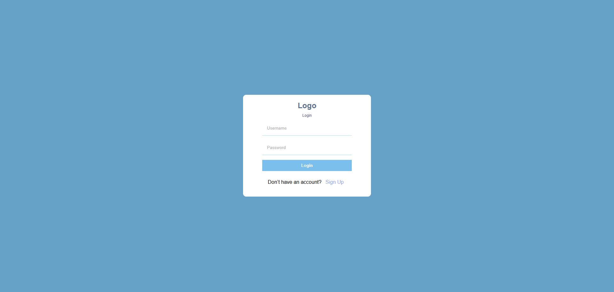
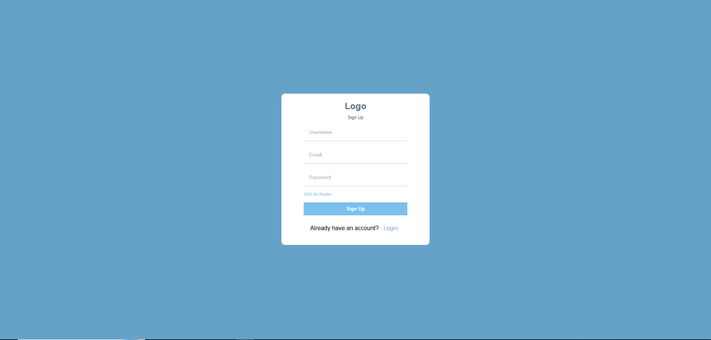

<div align="center">

# 💬 Chat Karo

> A modern full-stack real-time chat application built with the **MERN Stack**, **Socket.IO**, and **JWT Authentication**.

🚧 **Status:** Actively Under Development

[](https://chat-karo-test-1.abasthan.app/login)
[](https://fold-wry-gecko.abasthan.app/)
[](LICENSE)

</div>

---

# 📑 Table of Contents

- About
- Features
- Tech Stack
- Project Architecture
- Folder Structure
- Screenshots
- Installation
- Environment Variables
- Running Locally
- API Overview
- Socket Events
- Roadmap
- Known Issues
- Future Improvements
- Learning Outcomes
- Deployment
- Contributing
- Author

---

# 📖 About

**Chat Karo** is a real-time chat application built to explore production-level full-stack development using the MERN Stack.

The project focuses on:

- REST API Development
- JWT Authentication
- Real-Time Communication using Socket.IO
- MongoDB Database Design
- Redux State Management
- Secure Backend Architecture
- Cloud Deployment

This project is continuously improving as I learn more advanced backend and frontend concepts.

---

# ✨ Features

## ✅ Currently Available

- User Registration
- User Login
- JWT Authentication
- Protected Routes
- Real-Time Messaging
- Online User Status
- Responsive User Interface
- MongoDB Integration
- REST APIs
- Socket.IO Communication
- Secure Password Hashing
- Cloud Deployment

---

## 🚧 Upcoming Features

- Emoji Support

- User Profiles
- Friend Requests
- Push Notifications
- File Sharing
- Image Sharing
- Message Reactions
- Message Delete
- Message Edit
- User Search
 

---

# 🛠 Tech Stack

## Frontend

- React.js
- Vite
- Redux Toolkit
- React Router DOM
- Axios
- Socket.IO Client
- CSS

## Backend

- Node.js
- Express.js
- MongoDB
- Mongoose
- JWT
- Socket.IO
- bcrypt
- Cookie Parser
- Multer

---

# 🏗 Project Architecture

```text
                User
                  │
                  ▼
         React + Redux Frontend
                  │
     REST API + Socket.IO Client
                  │
                  ▼
         Express.js Backend
          │               │
          │               │
     JWT Authentication   Socket.IO
          │               │
          └───────┬───────┘
                  │
             MongoDB Atlas
```

---

# 📂 Folder Structure

```text
Chat-App
│
├── Backend
│   ├── Controller
│   ├── Middleware
│   ├── models
│   ├── routes
│   ├── Sockets
│   ├── uploads
│   ├── Utilities
│   ├── app.js
│   ├── server.js
│   ├── package.json
│   └── package-lock.json
│
├── Frontend
│   ├── public
│   ├── src
│   ├── index.html
│   ├── vite.config.js
│   ├── eslint.config.js
│   ├── package.json
│   ├── package-lock.json
│   └── README.md
│
└── README.md
```

---

# 📸 Screenshots

## 🔐 Login Page

```md

```

---

## 📝 Register Page

```md

```

---

## 💬 Chat Dashboard

```md

```

---

## 👥 User List

```md

```

---

## 📱 Mobile Responsive

```md

```

---

## 🖥 Frontend Folder Structure

```md

```

---

## ⚙ Backend Folder Structure

```md

```

---

## 🗄 MongoDB Collections

```md

```

---

## 🔌 API Testing

```md

```

---

## ⚡ Socket.IO Flow

```md

```

---

# 🚀 Installation

Clone the repository

```bash
git clone https://github.com/Code-with-saurabh/Chat-app.git
```

Go inside the project

```bash
cd Chat-app
```

---

## Backend Setup

```bash
cd Backend

npm install

npm start
```

---

## Frontend Setup

```bash
cd Frontend

npm install

npm run dev
```

---

# 🔑 Environment Variables

## Backend (.env)

```env
PORT=

MONGO_URI=

JWT_SECRET=

CLIENT_URL=
```

---

## Frontend (.env)

```env
VITE_API_URL=

VITE_SOCKET_URL=
```

---

# 🌐 Live Demo

## Frontend

https://chat-karo-test-1.abasthan.app/login

---

## Backend

https://fold-wry-gecko.abasthan.app/

---

# 📡 API Overview

| Method | Endpoint | Description |
|---------|----------|-------------|
| POST | /register | Register User |
| POST | /login | Login User |
| POST | /logout | Logout User |
| GET | /users | Get Users |
| GET | /messages | Fetch Messages |
| POST | /message | Send Message |

---

# ⚡ Socket Events

| Event | Description |
|--------|-------------|
| connection | User Connected |
| disconnect | User Disconnected |
| sendMessage | Send Message |
| receiveMessage | Receive Message |
| onlineUsers | Update Online Users |

---

# 🛣 Roadmap

- ✅ Authentication
- ✅ JWT Authorization
- ✅ Socket.IO Integration
- ✅ Real-Time Messaging
- ✅ Online Users
 
- ⏳ Typing Indicator
- ⏳ Notifications
- ⏳ Image Sharing
- ⏳ File Upload
- ⏳ Dark Mode
 

---

# 🐞 Known Issues

- Some UI improvements are in progress.
- Performance optimizations are ongoing.
- More validations will be added in future releases.

---

# 📈 Future Improvements

- Docker Support
- Redis Caching
- PostgreSQL + Prisma
- CI/CD Pipeline
- Unit Testing
- Integration Testing
- AWS Deployment
- Nginx Reverse Proxy
- Kubernetes Deployment
- WebRTC Video Calling

---

# 🎯 Learning Outcomes

During this project I learned:

- Full Stack Application Development
- REST API Design
- MongoDB Schema Design
- Authentication using JWT
- Password Hashing
- Socket.IO
- Redux Toolkit
- Cloud Deployment
- Backend Folder Structure
- Production-Level Project Organization

---

# 🚀 Deployment

| Service | Platform |
|----------|----------|
| Frontend | Abasthan |
| Backend | Abasthan |
| Database | MongoDB Atlas |

---

# 🤝 Contributing

Contributions are welcome.

If you'd like to improve the project:

1. Fork the repository
2. Create a feature branch
3. Commit your changes
4. Push your branch
5. Open a Pull Request

---

# 👨‍💻 Author

**Saurabh Sharma**

MERN Stack Developer

GitHub: https://github.com/Code-with-saurabh

---

# ⭐ Support

If you found this project helpful,

Please consider giving it a ⭐ on GitHub.

It helps motivate me to continue building and improving open-source projects.

---

<div align="center">

Made with ❤️ by **Saurabh Sharma**

</div>
